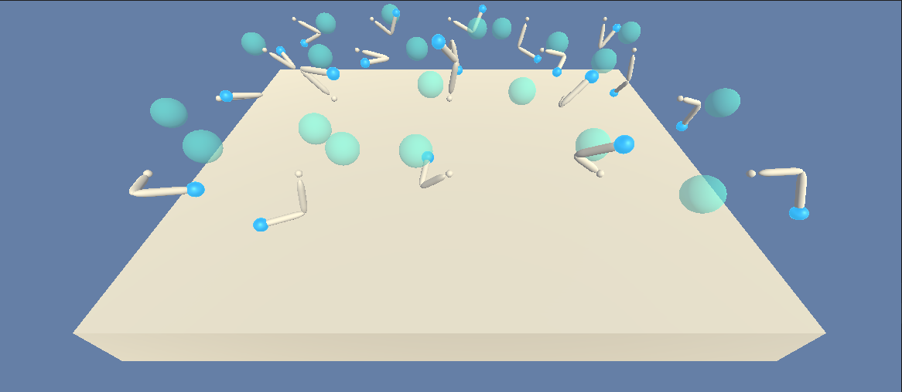
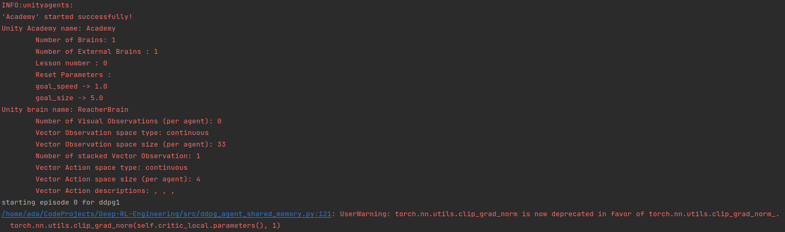

# Solving REACHER with Deep Reinforcement Learning



## Project Details 

This repository contains python code that implements _deep reinforcement learning_ to solve the problem of controlling a double jointed arm and keeping the hand in a specified three dimensional space.

### Environment Details

The environment consists of 20 arms to control and keep in different target locations. For each arm, the environment keeps track of 33 variables provide data for:

1. Position
2. Velocity
3. Rotation
4. Angular Velocity

Additionally, the action space for each arm consists of 4 real numbers between 1 and -1 that specifies the torque.

## Getting Started

Follow the steps below to setup an environment to run the project.

Start by creating a new environment with python 3.6 (**Note:** python 3.6 is necessary for tensorflow 1.7.1 and the unity environment will not work without this version.)

```bash
conda create --name drlnd python=3.6
source activate drlnd
```

Next, clone the __deep-reinforcement-learning__ repository to install the _unity agent_ dependency.

```bash
git clone https://github.com/udacity/deep-reinforcement-learning.git
cd deep-reinforcement-learning/python
pip install .
```

Then, use _pip_ to install the requirements detailed in the requirements text file.

```bash
pip install -r requirments.txt
```

Finally, source the conda environment with

```bash
conda activate drlnd
```

## Execution Instructions

The agents can be trained by executing __train_agents.py__ with the command:

```python
python train_agents.py
```

Running train_agents.py will start up the unity environment and begin training the model.



