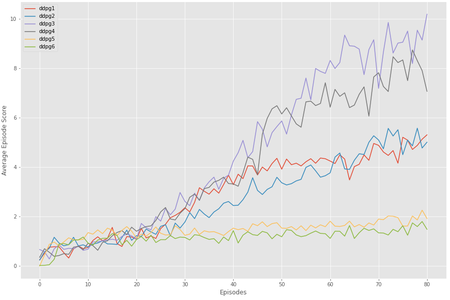
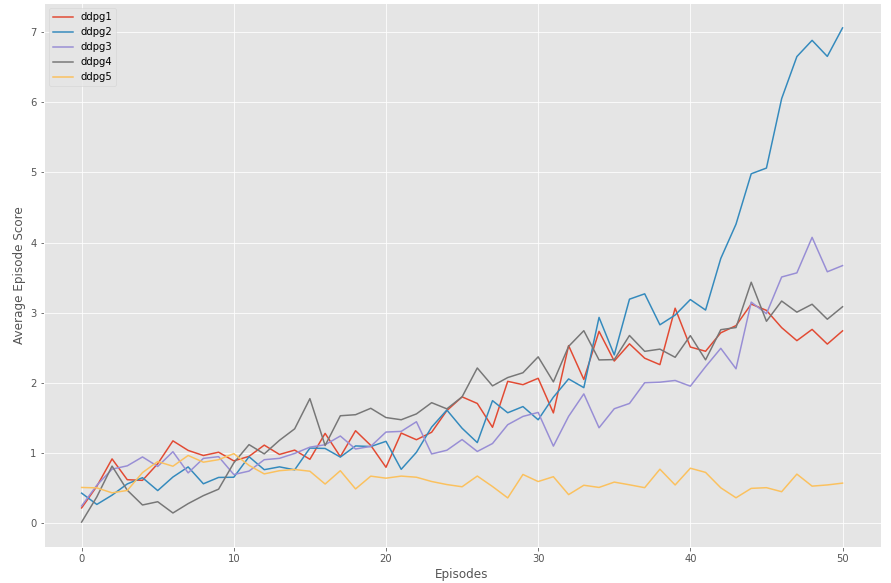
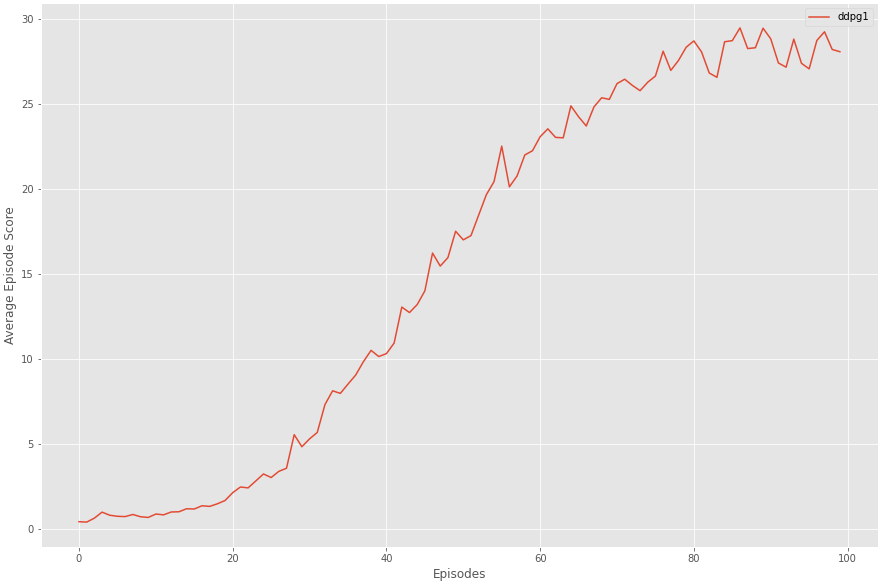
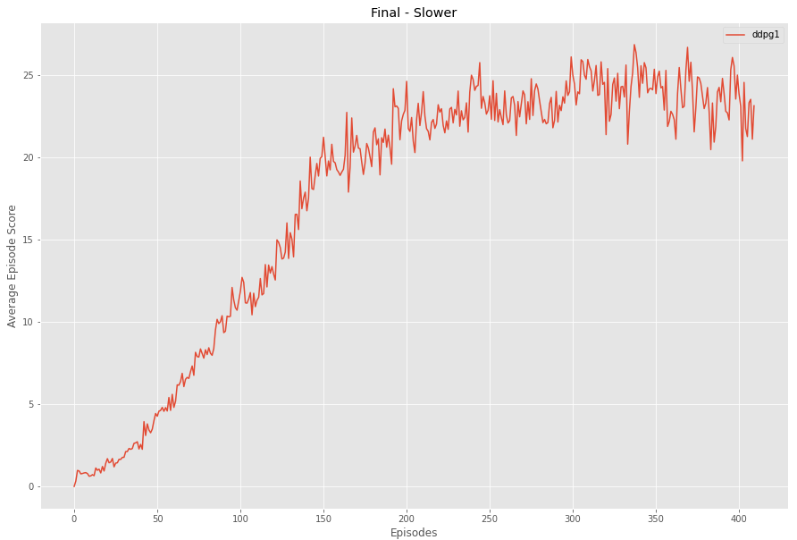
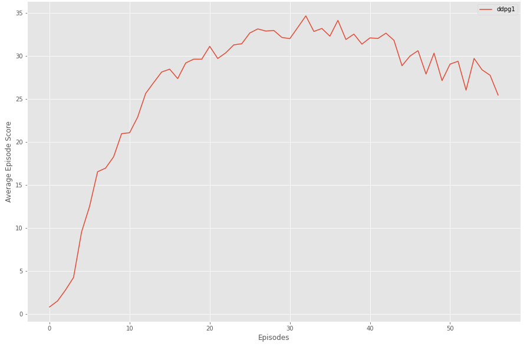
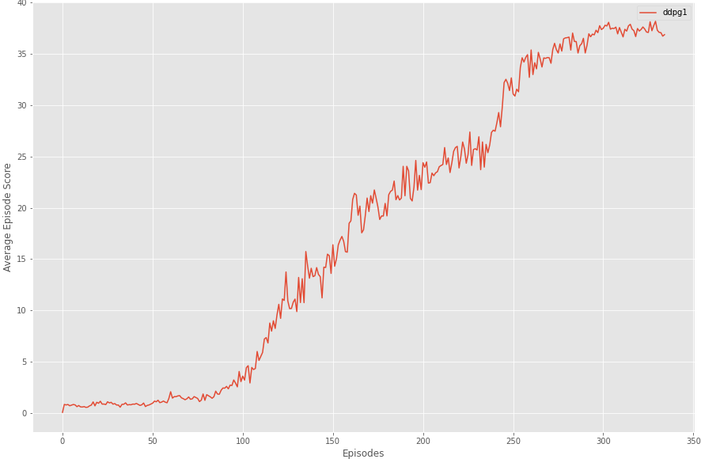
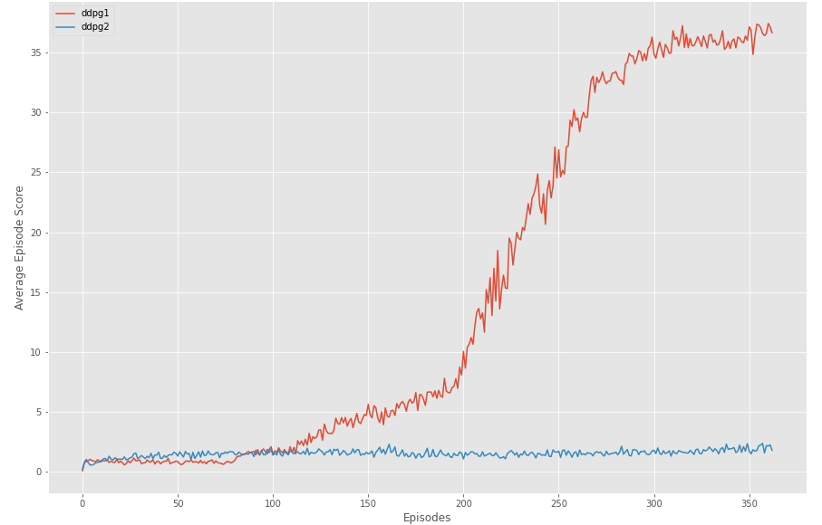

# Introduction

This project was created to use modern methods of continuous control to solve the Reacher problem from AI Gym, which is maintaining the hand of a double-jointed arm in a specific three-dimensional space. This project solved a variation of the problem that involved managing 20 arms, instead of just 1. For each arm, the Reacher environment maintains a state of 33 values corresponding to different characteristics of the arm, such as velocity, rotation, and position. Additionally, agent that controls the arm has an action space of 4 numbers between -1 and 1 for the arm's torque. The agent is rewarded a value of 0.1 for each time step that it can maintain the hand of the arm in the target space through manipulation of the torque, with the number of time steps for the task being exactly 1000. The agent was considered successful if it could maintain an average greater than 30 for 100 consecutive episodes between all 20 arms. In this report, the learning algorithm, hyper parameters, and performance are all discussed.

# Learning Algorithm

The learning algorithm used for each agent in the project is based on the Deep Deterministic Policy Gradient (DDPG) algorithm presented by Lillicrap et al. (2016) to solve the problem of continuous control of the arms through the action space. The actor for each agent consists of a neural network that determines the action and loss is calculated by the critic. The critic for each agent consists of a neural network that determines the Q-value and loss is determined with the error between Q expected and Q targets.

Additionally, both the actor and critic make use of local and target networks as described in Mnih et al (2015), but with various scales used for soft update and intervals for the updates.

Finally, the algorithm also made use of shared experience replay buffer to sample during the learning step. 

#### Neural Network Architectures

Two neural network architectures were used in this project.  The first network variant consisted of two layers. The first layer was a fully connected layer with 400 nodes and rectified linear unit activation function. The second layer consisted of a fully connected layer with 300 nodes and a hyperbolic tangent activation function.

The second neural network variant consisted of three layers. The first layer was a fully connected layer with 400 nodes and a rectified linear unit activation function. The second layer consisted of a fully connected layer with 300 nodes and a rectified linear unit activation function. The third layer consisted of a fully connected layer with 100 nodes and a hyperbolic tangent activation function.

#### Learning Algorithm Procedure

The following pseudo code for the learning algorithm used in this project.

```ps
ALLOCATE REPLAY_BUFFER

For each of the 20 agents:
	initialize local_actor
	initialize target_actor
	initialize local_critic
	initialize target_critic
Next

While mean(scores) < 30:
	reset environment
	Do Until Done:
		For each of the 20 Agents:
			Find action
			Take action against environment with state
			Save next_state, reward, and done
			Add reward to scores
			Add experience to shared replay buffer
			Learn
```


# Results

Several attempts were made before finding the final solution. The subsections here detail those attempts and provide information regarding the parameters of the learning algorithm used in the attempts.

#### Attempt 1

The first attempt involved using 6 groups of 20 agents, each with different parameters for the learning algorithm. The purpose of the attempt was to glean intuition on the effect parameters have on performance. The image below details the performance of these 6 groups after 80 episodes. The y-axis details the average score of the group and the x-axis details the episode. Each trace on the image corresponds to one of the 6 groups, with ddpg3 and ddpg4 performing the best and ddpg5 and ddpg6 performing the worst. ddpg1 and ddpg2 served as the baseline in this attempt and performed in between the others.



The configuration for each of the groups is presented in the table below.

| Name  | Buffer Size | Batch Size | Gamma | Tau   | Actor LR    | Critic LR  | Learning Interval       | Network Architecture | Purpose            |
| ----- | ----------- | ---------- | ----- | ----- | ----------- | ---------- | ----------------------- | -------------------- | ------------------ |
| ddpg1 | 100000      | 64         | 0.99  | 0.001 | 0.0001      | 0.001      | 10 times every 20 steps | First Variant        | Baseline           |
| ddpg2 | 100000      | 64         | 0.99  | 0.001 | 0.0001      | 0.001      | 10 times every 20 steps | Second Variant       | Baseline           |
| ddpg3 | 100000      | **128**    | 0.99  | 0.001 | 0.0001      | 0.001      | 10 times every 20 steps | First Variant        | Batch Size Test    |
| ddpg4 | 100000      | **128**    | 0.99  | 0.001 | 0.0001      | 0.001      | 10 times every 20 steps | Second Variant       | Batch Size Test    |
| ddpg5 | 100000      | 128        | 0.99  | 0.001 | **0.00001** | **0.0001** | 10 times every 20 steps | First Variant        | Learning Rate Test |
| ddpg6 | 100000      | 128        | 0.99  | 0.001 | **0.00001** | **0.0001** | 10 times every 20 steps | Second Variant       | Learning Rate Test |

The table and image made it clear that increasing the *Batch Size* led to better performance, and decreasing the learning rate seemed to slow learning down to the point of being impractical. This attempt also showed that the second variant of the network architecture performed *slightly* better that the first variant. 

#### Attempt 2

The second attempt built on the results of the first attempt and further explored changes to the parameters of the learning algorithm. The second attempt used 5 groups of 20 agents, with the performance results shown below after 50 episodes. Around episode 40, ***ddpg2*** was observed to perform much noticeable better than the other groups.



The configuration for each of group in this attempt is presented in the table below.

| Name  | Buffer Size | Batch Size | Gamma | Tau        | Actor LR    | Critic LR  | Learning Interval       | Network Architecture | Purpose                |
| ----- | ----------- | ---------- | ----- | ---------- | ----------- | ---------- | ----------------------- | -------------------- | ---------------------- |
| ddpg1 | 100000      | 128        | 0.99  | 0.001      | 0.0001      | 0.001      | 10 times every 20 steps | Second Variant       | Baseline               |
| ddpg2 | 100000      | **256**    | 0.99  | 0.001      | 0.0001      | 0.001      | 10 times every 20 steps | Second Variant       | Larger Batch Size Test |
| ddpg3 | **50000**   | 128        | 0.99  | 0.001      | 0.0001      | 0.001      | 10 times every 20 steps | Second Variant       | Smaller Buffer Test    |
| ddpg4 | 100000      | 128        | 0.99  | 0.001      | **0.00001** | **0.0001** | 10 times every 20 steps | Second Variant       | Learning Rate  Test    |
| ddpg5 | 100000      | 128        | 0.99  | **0.0001** | 0.0001      | 0.001      | 10 times every 20 steps | Second Variant       | Tau Test               |

The table and image made it clear that further increasing of the batch size led to better performance.  It was interesting to note that decreasing the buffer size by half did not have a significant impact on performance and the lower learning rate seemed to perform similarly to the baseline during this attempt. Finally, the results made it clear that decreasing the Tau weight can hinder performance.

#### Attempt 3

With the results of the previous two attempts, this was the first attempt to truly solve the problem. A single agent group of 20 agents was used with the following parameters detailed below:

| Name  | Buffer Size | Batch Size | Gamma | Tau   | Actor LR | Critic LR | Learning Interval       | Network Architecture |
| ----- | ----------- | ---------- | ----- | ----- | -------- | --------- | ----------------------- | -------------------- |
| ddpg1 | 100000      | 512        | 0.99  | 0.001 | 0.0001   | 0.001     | 10 times every 20 steps | Second Variant       |

However, this group seemed to be unable to reach the minimum of 30 even once in the first 100 episodes and seemed to stop improving around episode 80, as shown below:



#### Attempt 4

After failing to score above 30 in attempt 3, a fourth attempt was made that lowered the learning rate for the actor and critic networks. A single agent group of 20 agents was used again with the following parameters:

| Name  | Buffer Size | Batch Size | Gamma | Tau   | Actor LR | Critic LR | Learning Interval       | Network Architecture |
| ----- | ----------- | ---------- | ----- | ----- | -------- | --------- | ----------------------- | -------------------- |
| ddpg1 | 100000      | 512        | 0.99  | 0.001 | 0.00001  | 0.0001    | 10 times every 20 steps | Second Variant       |

However, this group seemed to be unable to reach the minimum of 30 even once as well. The group took longer to plateau than the previous attempt, occurring at episode 150 rather than 80. For the next 250 episodes, this agent group would seldom score above 25. 



#### Attempt 5

After failing to reach 30 twice, a fifth attempt was made that altered the learning interval to be drastically higher than all previous attempts. This attempt changed the interval from 10 times every 20 steps, to 10 times every 2 steps. So, each agent went from *training 500 times* per episode to *training 5000 times* per episode. The batch size was also decreased for performance reasons and the buffer size was increased.

| Name  | Buffer Size | Batch Size | Gamma | Tau   | Actor LR | Critic LR | Learning Interval          | Network Architecture |
| ----- | ----------- | ---------- | ----- | ----- | -------- | --------- | -------------------------- | -------------------- |
| ddpg1 | 500000      | 256        | 0.99  | 0.001 | 0.00001  | 0.0001    | **10 times every 2 steps** | Second Variant       |

The results were promising at first, but near episode 35, it became clear that the algorithm was crashing. The final result of the algorithm was that it achieved scoring higher than 30, but failed to achieve an average above 30 for 100 episodes.



#### Attempt 6

After seeing the results the learning interval change had on the performance, a sixth attempt was a made to see how the agent group would perform if it updated very infrequently, such at it would learn 10 times per 100 episodes. That its, 100 times per episode as opposed to the 500 times of most attempts and 5000 times of the last event. The specifics of this attempt were:

| Name  | Buffer Size | Batch Size | Gamma | Tau   | Actor LR | Critic LR | Learning Interval            | Network Architecture |
| ----- | ----------- | ---------- | ----- | ----- | -------- | --------- | ---------------------------- | -------------------- |
| ddpg1 | 100000      | 512        | 0.99  | 0.001 | 0.00001  | 0.0001    | **10 times every 100 steps** | Second Variant       |

The results were fantastic. The agent group performed better than any previous attempt and took significantly less time to train, only 6 hours in real time as opposed to the usual 20 or 30 hours real time. The model seemed to plateau at a score of 37 around episode 300 and achieved the objective of an average score above 30 around episode 340.



#### Final Attempt

After meeting the objective in the 6th attempt, one more attempt was made to determine if the results were reproducible and see if the performance would have been the same with the smaller first network variant. The specifics were:

| Name  | Buffer Size | Batch Size | Gamma | Tau   | Actor LR | Critic LR | Learning Interval        | Network Architecture | Purpose                     |
| ----- | ----------- | ---------- | ----- | ----- | -------- | --------- | ------------------------ | -------------------- | --------------------------- |
| ddpg1 | 100000      | 512        | 0.99  | 0.001 | 0.0001   | 0.001     | 10 times every 100 steps | **Second Variant**   | Reproduce attempt 6 results |
| ddpg2 | 100000      | 512        | 0.99  | 0.001 | 0.0001   | 0.001     | 10 times every 100 steps | **First Variant**    | Baseline first variant      |

This attempt saw very similar results to attempt 6 with ddpg1, but ddpg2 did not perform nearly as well. In this attempt, ddpg1 was also able to meet the requirement of an average greater than 30 over 100 episodes, achieving this at episode 364.



# Conclusion

After 7 attempts and countless hours of training, the Reacher problem was solved and saved weights from the final attempt are saved in the repository ([link here](https://github.com/Maple-Lazuli/Deep-RL/tree/main/saved_models)). This was a great challenge and provided the unique insight that rules of thumb are not always sufficient for parameter choosing and that it can be worthwhile to try counter intuitive parameters. 

For future work, it would be exciting to future experiment with the **learning interval** to find configurations that take less training time and perform better. It was clear, in hindsight, that a cognitive bias prevented the idea of experimenting with the learning interval, so it would be beneficial to study the effects of modifying it and glean a deeper intuition surrounding it. 

# References

Volodymyr Mnih, Koray Kavukcuoglu, David Silver, Andrei A. Rusu, Joel Veness, Marc G. Bellemare, Alex Graves, Martin Riedmiller, Andreas K. Fidjeland, Georg Ostrovski, Stig Petersen, Charles Beattie, Amir Sadik , Ioannis Antonoglou, Helen King, Dharshan Kumaran, Daan Wierstra, Shane Legg & Demis Hassabis. (2015). *Human-level control Through Deep Reinforcement Learning*. Nature 518. https://www.nature.com/articles/nature14236

Timothy P. Lillicrap, Jonathan J. Hunt, Alexander Pritzel, Nicolas Heess, Tom Erez, Yuval Tassa, David Silver, Daan Wierstra. (2016).  Continuous control with deep reinforcement learning. https://arxiv.org/abs/1509.02971


